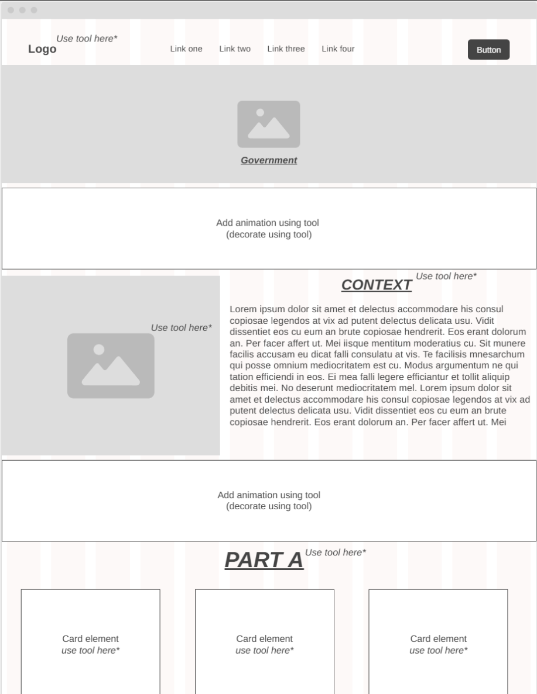
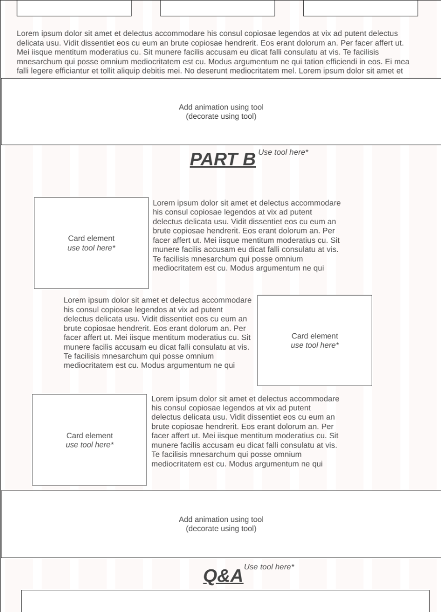
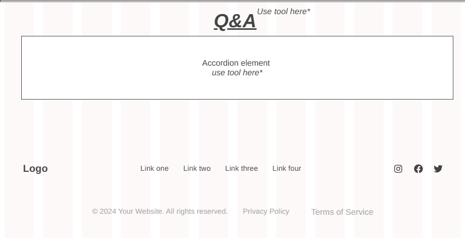
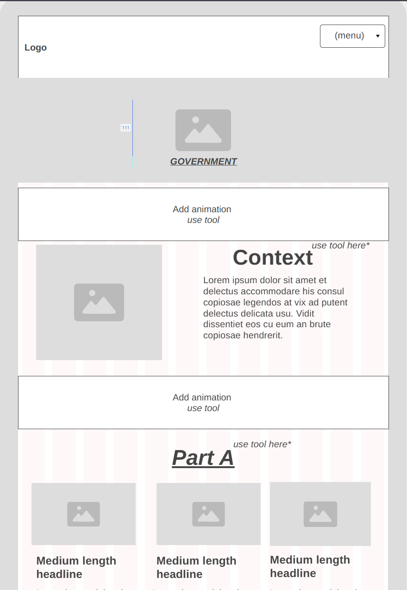
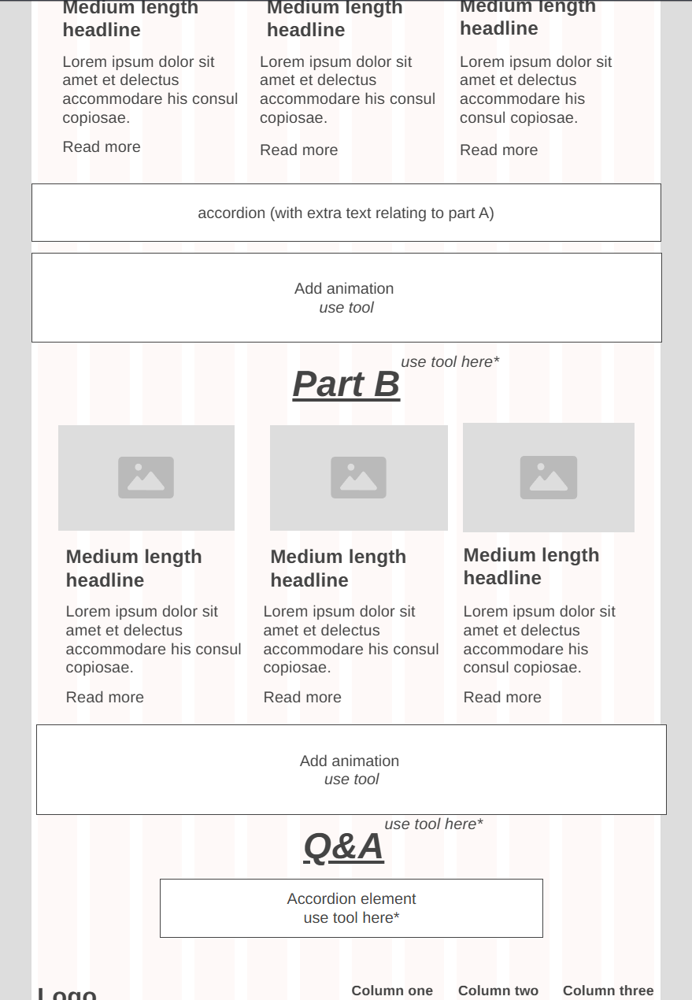
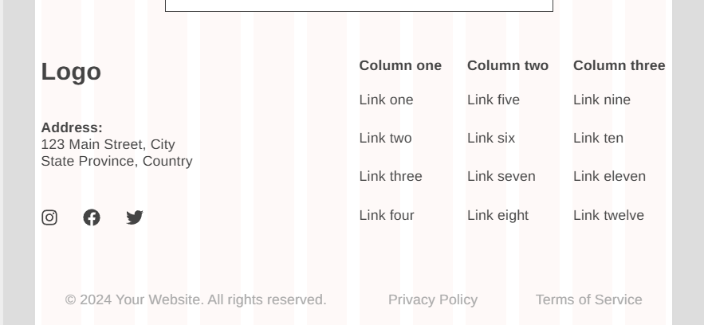
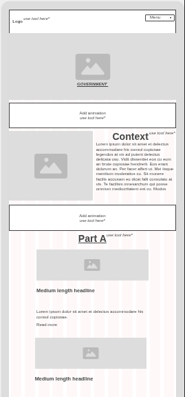
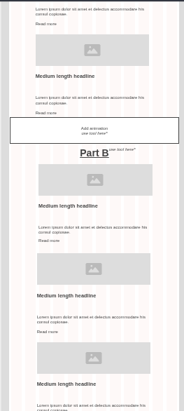
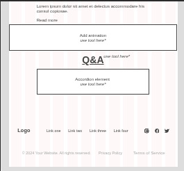

# Entry 6
##### 05.10.2025

## How I Made my MVP

### Wireframes:
The first step for when it came to making our MVP is creating a wireframe, that way I would be able to know how to organize my website, instead of thinking of a layout on the stop. It was sort of used as a guide for me, with me not needing to actually follow it step by step. 
#### Wireframe For Large Viewport:




While making my wireframe for a large viewport, it wasn't much of a struggle since I had the ideas in my head all planned out. Also when it came to making wireframes for larger viewports in general I tend to struggle less since larger viewports five me more freedom to do add more content. Whereas for my wireframe for smaller viewports I found myself struggling. 

#### Old Version of Wireframe for Smaller Viewports: 




At first when I submitted the mobile version of my wireframe, I was confident that I would be approved immediately, that is I untill I saw the comment that Mr.Mueller put on my wireframe telling em that I the two wireframes are virtually the same and that my mobile wireframe would have to look more responsive. And after taking in his feedback and look at the mobile vesrsion of my wireframe, I realized that he was right, it didn't look responsive at all. 

I realized that the mobile version of my website, the cards that I was going to use would have to stack on top of each other in order for it to be more easily readable by the viewer, which is the main thing that I changed about the mobile version of my wireframe. 

#### Updated Version of Wireframe for Smaller Viewports: 




As you can see in my new updated wireframe, I fixed the mistakes and took in the feedback that I was given by Mr.Mueller. This time I changed my cards so that they stacked on top of each other, and I made some minor changes to make it look more organized when it's on a smaller viewport. 

After I made the changes to the mobile version of my wireframe, I was finally approved to start coding my MVP

### Coding the MVP:
The thought of actually coding my MVP was a process I have been dreading since the begining of the year once I was infromed that we had to code our own site by scratch. But when I actually started coding, I found myself ot be quite into it, more than I expected. 

#### Navbar:
The first thing I decided to do is start on the basics such as getting the code for the components that I was going to use. The main ones that I was sure of using was a bootstrap navbar and cards. But since I wanted my navbar to be the first thing I saw in my code, it was the first piece of code that I imported to my site. 

``` HTML
<nav class="navbar navbar-expand-lg navbar-light bg-light fixed-top">
    <a class="navbar-brand" href="#government">Government</a>
      <button class="navbar-toggler" type="button" data-toggle="collapse" data-target="#navbarNav" aria-controls="navbarNav" aria-expanded="false" aria-label="Toggle navigation">
        <span class="navbar-toggler-icon"></span>
      </button>
      <div class="collapse navbar-collapse" id="navbarNav">
        <ul class="navbar-nav">
          <li class="nav-item active">
            <a class="nav-link" href="#context">Context</a>
          </li>
          <li class="nav-item">
            <a class="nav-link" href="#softwares">Softwares</a>
          </li>
          <li class="nav-item">
            <a class="nav-link" href="#hardwares">Hardwares</a>
          </li>
          <li class="nav-item">
            <a class="nav-link" href="#innovations">Future Innovations</a>
          </li>
        </ul>
      </div>
    </nav>
```
At first when I created the navbar, it didn't have the code `fixed-top` but as I was previewing my website, I realized that if I had the navbar follow you no matter the scroll position, it would be more easier for the veiwer to switch to different sections instead of having ot scroll to each individual section. Which is why I included the `fixed-top`

#### Bootstrap Grid System:
When we first learned how to use the grid sytem in class, I was so confused. I even got a 6/10 on the bootstrap quiz that we took in class. Though if I wanted my website to be responsive, organized, and to look like how I envisioned it. I would have to learn how to use the grid system. 

In order to learn how to use the grid system, I went to the offical [GetBootstrap](https://getbootstrap.com/docs/5.3/layout/columns/) website, and I went to the column section and I saw this section:

'

After seeing this example how to use it, everything came together. The only thing that I was able to understand about bootstrap is how to section them off such as `col-md-6`, but now I was able to know how they can appear properly on the screen. 

After learning how to use the grid system, and columns, I used them for almost every aspect of website:  

``` HTML
<div class="box">
  <div class="container text-align">
    <div class="row">
      <div class="col-md-6 image-one">
      
      </div>
      <br>
      <div class="col-md-6">
        <h2 class="context animate__animated animate__heartBeat animate__infinite" id="context">Context</h2>
        <p>What is the government? When you think about it may seem like an easy question to answer. Most typically saying, <em>“The government is a group of people who run the country”</em> or <em>“They make laws”</em>. All of these are simple, but yet factually correct answers. Most of them being universally correct answers. Though if you wanted to have a more complex answer, it would vary depending on the person and region. The reason for this being that there are different types of governments all around the world. Such as a democracy, in which the people have the power. There’s monarchies with their country being ruled by a king or queen. Then we have authoritarianism with the power being held by one person or a small group. We then have a republic, with the citizens having the ability to elect their representative. There’s also a theocracy, a nation being ruled by religious law. As you can see all these types of governments vary from one another to a different extent. Therefore, changing the perspective and belief of people who give an in-depth answer as to what the government is. Despite the differences, there is something that every government around the world can commonly agree on. They exist to create order, manage society, and maintain control—regardless of who’s in charge or how they got there. In order for them to achieve this they use technology such as <b>softwares</b> and <b>hardwares</b> to make that job more efficient for them.
        </p>
        </div>
      </div>
    </div>
  </div>
```
#### Content:
While coding my MVP, I decided that I will set up my basic layout, then I would add all my content which I reasearched towards the begining of the year. Since it was such a long time ago I didn't really remember what information I had, that is untill I was about to add it into my site. 

When I was overlooking the content I was dissatisfied with the research that I found for the software section of my topic, since I found it unrealted the theme that I was going for. Therefore I researched the software section from scratch all over again.

This time I decided to research softwares that are used in the government, to make it more easeir and accesible for them to use. This time since I had a narrowed down topic that I was looking for it made research more easier for me. 

All I had to do was serach up "Softwares used in the government" and I found most of the sites immediately:


After doing a bit more seraching, I found the three sites that I was most satisfied with which are [OpenGov](https://opengov.com/), [Oracle](https://www.oracle.com/government/govcloud/), and [Accela](https://www.accela.com/press-releases/accela-named-to-govtech-100-list-for-tenth-consecutive-year/). All three of these sites are meatn for making government work more easier, and accesible to the public as well. 

After finding these new sites for the software part of the topic, I was finally satisfied with the reserach that I have for my content. 

## Challenges 
### `div`
The main thing that I found myself struggling on throughout coding my whole MVP, was the `divs`. Sometimes I would use columns and rows but then it won't appear. And everytime I double check it seems like I did correctly. And in order to solve my issues I would promptly delete the whole grid system and readd it, and despite doing the same thing as last time, it would show up this time. The reason for this being is the placement of divs being in the wrong area, which messes up the whole thing.

This issue started happening so often, that I started to get really frustrated. Therfore I found a solution, I would label each div pair to exactly where it belongs, and would include extra spacing between them untill I know it works. Though this method isn't efficent, and took up more time it still solved my problem:

``` HTML
  <div id="panelsStayOpen-collapseTwo" class="accordion-collapse collapse" data-bs-parent="#accordionExample">
    <div class="accordion-body">
        <div class="container">
            <div class="row">
                <div class="col-md-6">
                    
                </div> <!--End of col image div-->
                    <div class="col-md-6">
                      <ul>
                        <li>Central to national security, economy, public health, and etc.</li>
                        <li>Produces and provides hardware, software, and information technology systems and services.</li>
                      </ul>
                </div> <!--End of col text div-->
            </div> <!--End of row div-->
        </div> <!--End of container div-->
    </div>
</div>
</div>
```
As you can see from this snippet of code I had to comment each column, row, and container div in order for me to ensure that each div is in the right placement.

### Responsive Cards 
While creating my website, I wanted to make all the cards the same size, therefore I used `width: 18rem` or something along the lines of that, This would make the cards all the same size, and it will look appealing when it's on a large viewport, though when I would make the veiwport smaller, the cards will stay the same size, no matter what and it will just look weird along with the alignment

At the time I didn't know that my issue was me adding the `width`, I thought it would have to do with the `col-md` sizes of my code. That is untill I asked Mr.Mueller, and that's when he pointed out that my issue had to do with the sizing of my cards having a fixed width, overwriting the responsiveness of the boostrap, causing it stay the same size no matter what. 

After I removed the width, my cards became resposive once again, though some of them are different sizes which annoyed me, I told myself that I will fix it after I finish my MVP, and go beyond it. 


## Skills 
### Organization 
In order for your code to work properly, it has to be organized, otherwise it doesn't fucntion the way it supposed to. This can go for `divs`, indentation, and commenting. Without having indentation it can make the whole thing look messy, and you wouldn't know what goes or connects to what. Without organized divs it can mess up your whole code, and without commenting it makes it harder to know what each part of code is meant for.

Therefore if you want your coding to be effeicent, and a smooth process you would have to learn to organize it properly. Which is why organization is a important skill to have when it comes to coding. 

### Self-Teaching 
Self teaching yourself is a important skill to have, since it allowed me to learn while I was doing my work at the same time. Sometimes in life you will have to teach yourself things, especially when that skill is fundamental to what you have to do. 

For me it was mandatory to use the bootstrap grid system in my project, since it will allow me to get full points, therefore I had to teach myself how to use it while coding which made my website. And through the experience of learning and implementing what I learned at the same time, allowed me to learn it quicker. Which taught me the skill that if you are going to self-teach yourself, it's better to implement it as soon as you learn it for a better learning experience. 

## EDP 
In terms of EDP, we are at the stage where we are creating the protoype for our freedom project. For us to get the most that we can out of this prototype, we made our own plan and layout, which further allowed us to get the most basic version of our website to be completed. It also allowed us to make sure that our website is responsive properly. So basically in this stage of the EDP, we had to make sure that every key feature is working correctly. 

## Takeaways 
Overall coding the most basic version of our website, is something that I'm quite proud of. And honestly I believe that this project allowed me to learn the most about coding then I did all year because of the freedom that I was given on it which allowed me to interact with the code more. Though there is still much that I can improve on, I stil am proud of this version of my website, especially considering the fact that I was finally able to grasp a better understand of what we learned this year in SEP 10. 


[Previous](entry05.md) | [Next](entry07.md)
[Home](../README.md)
